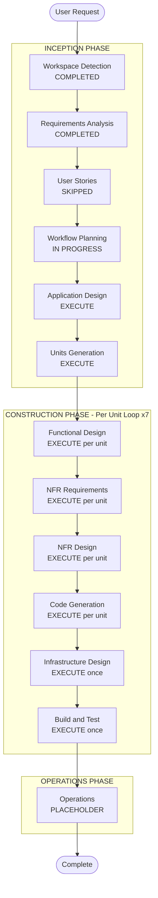

# Execution Plan — Smart Attendance Tracker

## Detailed Analysis Summary

### Change Impact Assessment

| Impact Area | Present | Description |
|---|---|---|
| User-facing changes | Yes | Full web UI for 3 user roles — Student, Faculty, Admin |
| Structural changes | Yes | New full-stack system — React frontend, Node/Express backend, MongoDB, Redis |
| Data model changes | Yes | New schemas: Users, Subjects, Attendance Records, Notifications, Settings |
| API changes | Yes | New RESTful API with 35+ endpoints across 6 service domains |
| NFR impact | Yes | Security Baseline (full), PBT (partial), cloud deployment, TLS, encryption at rest, Redis caching |

### Risk Assessment

| Attribute | Value |
|---|---|
| **Risk Level** | Medium-High |
| **Rationale** | Multi-role system with business logic (attendance calc, alerts), Redis token caching, security requirements, report generation, and cloud deployment |
| **Rollback Complexity** | Moderate — greenfield, no existing system to break |
| **Testing Complexity** | Complex — unit, integration, PBT, and security testing required |

---

## 1. Workflow Visualization



### Text Alternative — Workflow Sequence

```
INCEPTION PHASE
  [x] Workspace Detection          COMPLETED
  [x] Requirements Analysis        COMPLETED
  [-] User Stories                 SKIPPED
  [-] Workflow Planning            IN PROGRESS
  [ ] Application Design           EXECUTE
  [ ] Units Generation             EXECUTE

CONSTRUCTION PHASE (per unit x7, then once)
  [ ] Functional Design            EXECUTE (per unit)
  [ ] NFR Requirements             EXECUTE (per unit)
  [ ] NFR Design                   EXECUTE (per unit)
  [ ] Code Generation              EXECUTE (per unit)
  [ ] Infrastructure Design        EXECUTE (once, after all units)
  [ ] Build and Test               EXECUTE (once, after all units)

OPERATIONS PHASE
  [ ] Operations                   PLACEHOLDER
```

---

## 2. Application Architecture

### High-Level Architecture Diagram

```
+-----------------------------------------------------------------------+
|                          CLIENT LAYER                                 |
|                                                                       |
|   React.js 18 SPA                                                     |
|   +------------+  +----------+  +----------+  +----------+           |
|   |   Auth     |  | Student  |  | Faculty  |  |  Admin   |           |
|   |   Module   |  |Dashboard |  |Dashboard |  |Dashboard |           |
|   +------------+  +----------+  +----------+  +----------+           |
|   +------------------+  +----------------------------------+          |
|   |   Reports Module |  |   Alerts / Notifications Module  |          |
|   +------------------+  +----------------------------------+          |
|                                                                       |
|   Redux Toolkit (state)  |  Axios (HTTP + JWT interceptor)            |
+-----------------------------------------------------------------------+
                                    |
                              HTTPS / TLS 1.2+
                                    |
+-----------------------------------------------------------------------+
|                     REVERSE PROXY / LOAD BALANCER                    |
|              Nginx / Cloud ALB  (Rate Limiting, SSL Termination)      |
+-----------------------------------------------------------------------+
                                    |
+-----------------------------------------------------------------------+
|                        APPLICATION LAYER                              |
|                   Node.js 20 LTS + Express.js 4                       |
|                                                                       |
|  +-------------+  +-------------+  +-------------+  +-------------+  |
|  | Auth        |  | User        |  | Subject     |  | Attendance  |  |
|  | Service     |  | Service     |  | Service     |  | Service     |  |
|  +-------------+  +-------------+  +-------------+  +-------------+  |
|  +-------------+  +-------------+                                    |
|  | Report      |  | Notification|                                    |
|  | Service     |  | Service     |                                    |
|  +-------------+  +-------------+                                    |
|                                                                       |
|  Cross-cutting: JWT Middleware | Validation | Logger | Error Handler  |
+-----------------------------------------------------------------------+
              |                                    |
+---------------------------+      +------------------------------+
|       DATA LAYER          |      |       CACHE LAYER            |
|   MongoDB 7 (Atlas)       |      |   Redis 7                    |
|   Collections:            |      |   - Refresh token store      |
|   users | subjects        |      |   - Blacklisted tokens       |
|   attendance              |      |   - Rate limit counters      |
|   notifications           |      |   - Session metadata         |
|   settings                |      +------------------------------+
+---------------------------+
                                    |
+-----------------------------------------------------------------------+
|                       EXTERNAL SERVICES                               |
|          Email Provider: SendGrid / AWS SES (Alert delivery)          |
+-----------------------------------------------------------------------+
                                    |
+-----------------------------------------------------------------------+
|                       CLOUD INFRASTRUCTURE                            |
|   Compute: AWS ECS / Azure App Service / GCP Cloud Run                |
|   Database: MongoDB Atlas (managed, encrypted at rest)                |
|   Cache: AWS ElastiCache / Azure Cache for Redis                      |
|   Email: SendGrid / AWS SES                                           |
|   CDN/LB: AWS ALB / Azure Front Door                                  |
|   Secrets: AWS Secrets Manager / Azure Key Vault                      |
|   CI/CD: GitHub Actions / AWS CodePipeline                            |
+-----------------------------------------------------------------------+
```

### Technology Stack

| Layer | Technology | Version | Justification |
|---|---|---|---|
| Frontend | React.js | 18 LTS | Component-based UI, large ecosystem |
| State Management | Redux Toolkit | 2.x | Industry standard for complex multi-role state |
| HTTP Client | Axios | 1.x | JWT refresh interceptor support |
| Backend | Node.js | 20 LTS | Chosen by user, async I/O for attendance workloads |
| API Framework | Express.js | 4.x | Mature, flexible REST framework |
| Database | MongoDB | 7 (Atlas) | Flexible schema, chosen by user |
| ODM | Mongoose | 8.x | Schema validation, middleware hooks |
| Cache | Redis | 7 | Refresh token store, token blacklist, rate limit counters |
| Redis Client | ioredis | 5.x | Production-grade Redis client for Node.js |
| Auth | JWT + Refresh Token rotation | jsonwebtoken 9.x | Stateless, scalable, SECURITY-12 compliant |
| Token Cache | Redis | — | Refresh token storage and blacklisting on logout |
| Password Hashing | bcrypt | 5.x | Adaptive hashing, SECURITY-12 compliant |
| Input Validation | Joi | 17.x | Schema-based validation, SECURITY-05 compliant |
| Rate Limiting | express-rate-limit + Redis store | 7.x | Distributed rate limiting, SECURITY-11 compliant |
| Security Headers | helmet | 7.x | HTTP security headers, SECURITY-04 compliant |
| Logging | Winston + Morgan | 3.x | Structured logging with correlation IDs, SECURITY-03 |
| Email | Nodemailer + SendGrid/SES | — | Alert delivery |
| PDF Generation | PDFKit | 0.15.x | Monthly report PDF export |
| Excel Generation | ExcelJS | 4.x | Monthly report Excel/CSV export |
| PBT Framework | fast-check | 3.x | PBT-09 compliant, Jest integration |
| Testing | Jest + Supertest | 29.x | Unit and integration testing |
| CSV Parsing | csv-parse | 5.x | Bulk attendance upload parsing |

---

## 3. Component Breakdown

### Frontend Components

```
src/
  features/
    auth/
      LoginPage               Email/password login form
      ProtectedRoute          Role-based route guard (HOC)
      TokenRefreshInterceptor Axios interceptor for silent token refresh
    student/
      StudentDashboard        Attendance summary cards per subject
      AttendanceTable         Per-subject attendance history with filters
      StudentProfile          View/edit profile (name, photo, phone, parent)
      ReportDownload          Download monthly PDF/Excel report
      NotificationPanel       In-app alert list with read/unread state
    faculty/
      FacultyDashboard        Subject list with attendance overview
      AttendanceMarker        Per-student present/absent toggle per session
      BulkUploadForm          CSV/Excel file upload with validation feedback
      AttendanceEditor        Edit past session records (within window)
      SubjectAttendanceView   All students + percentages for a subject
      FacultyReportGenerator  Generate and download subject reports
    admin/
      AdminDashboard          Institution-wide attendance overview
      UserManagement          Create/update/deactivate Student/Faculty accounts
      SubjectManagement       Create/manage subjects, assign faculty
      EnrollmentManager       Enroll students into subjects
      ThresholdSettings       Configure global attendance threshold
      AdminReportCenter       Department and institution-wide reports
    reports/
      ReportFilters           Month/year/format selector
      ReportPreview           On-screen report preview table
      DownloadButton          PDF and Excel download triggers
    alerts/
      AlertBadge              Notification count badge on navbar
      AlertList               Paginated list of in-app notifications
      AlertItem               Single notification with read/dismiss action
    shared/
      Navbar                  Role-aware top navigation
      Sidebar                 Role-based collapsible menu
      DataTable               Reusable sortable/filterable/paginated table
      LoadingSpinner          Async state indicator
      ErrorBoundary           Global React error boundary
      ToastNotification       Success/error toast messages
      ConfirmDialog           Reusable confirmation modal
  store/
    authSlice                 JWT tokens, user role, login/logout actions
    userSlice                 Current user profile state
    attendanceSlice           Attendance records and percentage cache
    notificationSlice         In-app notification list and unread count
    reportSlice               Report generation state and download URLs
```

### Backend Services & Modules

```
src/
  services/
    auth/
      authController          POST /auth/login, /logout, /refresh
      authService             JWT generation, refresh rotation, Redis token store
      authMiddleware          Token verification + RBAC enforcement on every request
    users/
      userController          CRUD /users, GET /users/me
      userService             User creation, profile update, deactivation
      userModel               Mongoose schema (discriminator: Student/Faculty/Admin)
    subjects/
      subjectController       CRUD /subjects, /subjects/:id/faculty, /subjects/:id/students
      subjectService          Subject management, faculty assignment, enrollment
      subjectModel            Mongoose schema with collegeId extensibility field
    attendance/
      attendanceController    POST /attendance, PUT /attendance/:id, POST /attendance/bulk
      attendanceService       Marking logic, percentage calculation, duplicate prevention
      attendanceModel         Mongoose schema
      csvParser               csv-parse wrapper with validation and error reporting
    reports/
      reportController        GET /reports/* with month/year/format query params
      reportService           MongoDB aggregation, PDF generation, Excel generation
      pdfGenerator            PDFKit report template
      excelGenerator          ExcelJS report template
    notifications/
      notificationController  GET /notifications, PUT /notifications/:id/read
      notificationService     In-app notification CRUD
      alertService            Threshold check, 24h deduplication, trigger logic
      emailService            Nodemailer + SendGrid/SES email dispatch
      notificationModel       Mongoose schema
    settings/
      settingsController      GET /settings, PUT /settings/threshold
      settingsModel           Global settings Mongoose schema
  shared/
    middleware/
      rateLimiter             express-rate-limit with Redis store
      securityHeaders         helmet.js configuration
      requestLogger           Morgan + Winston with correlation ID injection
      errorHandler            Global error handler (SECURITY-15 compliant)
      validateRequest         Joi schema validation wrapper
    utils/
      logger                  Winston logger singleton
      jwtUtils                Token generation, verification, Redis blacklist check
      redisClient             ioredis singleton with connection pooling
      emailUtils              Email template builder and send helper
      correlationId           UUID-based request correlation ID generator
```

---

## 4. Unit Decomposition

The system is decomposed into **7 implementation units** executed in dependency order. Each unit is a complete vertical slice: Functional Design → NFR Requirements → NFR Design → Code Generation.

---

### Unit 1: Authentication & RBAC

| Attribute | Detail |
|---|---|
| **Scope** | JWT + Refresh Token auth, Redis token store, RBAC middleware, brute-force protection |
| **Frontend Modules** | Auth (LoginPage, ProtectedRoute, TokenRefreshInterceptor) |
| **Backend Modules** | Auth Service (authController, authService, authMiddleware) |
| **Data Models** | `users` collection (role field), Redis keys: `refresh:{userId}`, `blacklist:{token}` |
| **API Endpoints** | POST /auth/login, POST /auth/logout, POST /auth/refresh |
| **Dependencies** | None — foundation unit |
| **Inputs** | Email + password credentials |
| **Outputs** | Access token (JWT, 15min), Refresh token (JWT, 7d stored in Redis), RBAC context on every request |
| **Risks** | Redis unavailability breaks token refresh; mitigate with Redis sentinel/cluster and graceful degradation |
| **Test Strategy** | Unit: JWT encode/decode, bcrypt hash/verify, Redis token store/retrieve. Integration: login → refresh → logout flow. PBT: round-trip JWT encode/decode; invariant: blacklisted token always rejected |
| **Estimated Complexity** | High — security-critical, Redis integration, token rotation logic |

---

### Unit 2: User & Profile Management

| Attribute | Detail |
|---|---|
| **Scope** | Student/Faculty/Admin CRUD, extended student profile (photo, phone, parent contact) |
| **Frontend Modules** | StudentProfile, UserManagement (admin) |
| **Backend Modules** | User Service (userController, userService, userModel) |
| **Data Models** | `users` collection with Mongoose discriminator pattern (StudentProfile, FacultyProfile) |
| **API Endpoints** | GET /users/me, PUT /users/me, POST /users (admin), GET /users/:id (admin), PUT /users/:id (admin), DELETE /users/:id (admin) |
| **Dependencies** | Unit 1 (auth + RBAC middleware) |
| **Inputs** | User registration data, profile update payloads |
| **Outputs** | User profile objects, paginated user lists (admin) |
| **Risks** | Profile photo storage (binary in MongoDB vs object storage); mitigate with cloud object storage URL reference |
| **Test Strategy** | Unit: profile validation, role-scoped field access. Integration: admin creates user → student updates profile → admin deactivates. PBT: invariant: student cannot modify roll number or department |
| **Estimated Complexity** | Medium — straightforward CRUD with role-scoped field restrictions |

---

### Unit 3: Subject Management

| Attribute | Detail |
|---|---|
| **Scope** | Admin-managed subjects, faculty assignment, student enrollment |
| **Frontend Modules** | SubjectManagement, EnrollmentManager (admin), FacultyDashboard (subject list) |
| **Backend Modules** | Subject Service (subjectController, subjectService, subjectModel) |
| **Data Models** | `subjects` collection with `collegeId` extensibility field, embedded faculty/student reference arrays |
| **API Endpoints** | POST /subjects, GET /subjects, GET /subjects/:id, PUT /subjects/:id, DELETE /subjects/:id, POST /subjects/:id/faculty, DELETE /subjects/:id/faculty/:facultyId, POST /subjects/:id/students, DELETE /subjects/:id/students/:studentId, GET /subjects/:id/students |
| **Dependencies** | Unit 1, Unit 2 |
| **Inputs** | Subject metadata, faculty/student IDs for assignment |
| **Outputs** | Subject objects with enrolled student and assigned faculty lists |
| **Risks** | Large enrollment lists causing slow queries; mitigate with pagination and MongoDB indexes on subjectId + studentId |
| **Test Strategy** | Unit: enrollment validation, duplicate enrollment prevention. Integration: admin creates subject → assigns faculty → enrolls students. PBT: idempotency: enrolling same student twice has no effect; invariant: enrollment count never negative |
| **Estimated Complexity** | Medium — admin-only mutations, referential integrity between users and subjects |

---

### Unit 4: Attendance Engine

| Attribute | Detail |
|---|---|
| **Scope** | Manual attendance marking, CSV/Excel bulk upload, percentage calculation, duplicate prevention, correction window |
| **Frontend Modules** | AttendanceMarker, BulkUploadForm, AttendanceEditor, AttendanceTable, StudentDashboard (percentage display) |
| **Backend Modules** | Attendance Service (attendanceController, attendanceService, attendanceModel, csvParser) |
| **Data Models** | `attendance` collection: { studentId, subjectId, date, sessionId, status, markedBy, markedAt } |
| **API Endpoints** | POST /attendance (mark session), PUT /attendance/:id (edit), POST /attendance/bulk-upload (CSV/Excel), GET /attendance/subject/:id (faculty view), GET /attendance/student/:id (student view), GET /attendance/student/:id/subject/:subjectId/percentage |
| **Dependencies** | Unit 1, Unit 2, Unit 3 |
| **Inputs** | Session attendance data (manual or CSV), student/subject IDs |
| **Outputs** | Attendance records, real-time percentage per student per subject |
| **Risks** | CSV parsing errors with malformed files; large bulk uploads causing timeouts; mitigate with streaming parse, file size limits, and async job queue for large uploads |
| **Test Strategy** | Unit: percentage calculation formula, duplicate detection, CSV parser. Integration: mark attendance → verify percentage → edit record → verify updated percentage. PBT: round-trip CSV parse/serialize; invariant: percentage always in [0,100]; invariant: attended <= total classes |
| **Estimated Complexity** | High — core business logic, CSV parsing, duplicate prevention, real-time calculation |

---

### Unit 5: Reporting Engine

| Attribute | Detail |
|---|---|
| **Scope** | Monthly report generation (PDF + Excel/CSV), role-scoped data access, MongoDB aggregation |
| **Frontend Modules** | Reports (ReportFilters, ReportPreview, DownloadButton), StudentDashboard (report download), FacultyReportGenerator, AdminReportCenter |
| **Backend Modules** | Report Service (reportController, reportService, pdfGenerator, excelGenerator) |
| **Data Models** | No new collections — aggregates from `attendance`, `users`, `subjects` |
| **API Endpoints** | GET /reports/student/:id/monthly?month=&year=&format=, GET /reports/subject/:id/monthly?month=&year=&format=, GET /reports/department/:dept/monthly?month=&year=&format= (admin), GET /reports/institution/monthly?month=&year=&format= (admin) |
| **Dependencies** | Unit 1, Unit 2, Unit 3, Unit 4 |
| **Inputs** | Month, year, format (pdf/excel), scope (student/subject/department/institution) |
| **Outputs** | Downloadable PDF or Excel/CSV file with attendance summary |
| **Risks** | Large institution-wide reports timing out; mitigate with async generation + polling or streaming response |
| **Test Strategy** | Unit: aggregation pipeline correctness, PDF/Excel template rendering. Integration: generate report → verify totals match raw attendance records. PBT: invariant: report totals consistent with raw attendance data; round-trip: report data serialization |
| **Estimated Complexity** | High — MongoDB aggregation pipelines, PDF/Excel generation, role-scoped data access |

---

### Unit 6: Alert & Notification System

| Attribute | Detail |
|---|---|
| **Scope** | Threshold monitoring, 24h deduplication, in-app notifications, email delivery |
| **Frontend Modules** | Alerts (AlertBadge, AlertList, AlertItem), NotificationPanel (student) |
| **Backend Modules** | Notification Service (notificationController, notificationService, alertService, emailService, notificationModel) |
| **Data Models** | `notifications` collection: { userId, subjectId, type, message, read, sentAt, emailSentAt } |
| **API Endpoints** | GET /notifications (paginated, student-scoped), PUT /notifications/:id/read, PUT /notifications/read-all, DELETE /notifications/:id |
| **Dependencies** | Unit 1, Unit 2, Unit 3, Unit 4 (triggered post-attendance-marking) |
| **Inputs** | Attendance percentage update events from Unit 4, global threshold from Settings |
| **Outputs** | In-app notification records, email alerts via SendGrid/SES |
| **Risks** | Email service outage; mitigate with retry logic and dead-letter queue. Duplicate alerts; mitigate with Redis-backed 24h deduplication key |
| **Test Strategy** | Unit: threshold comparison logic, deduplication window check, email template rendering. Integration: mark attendance below threshold → verify in-app notification created → verify email dispatched. PBT: invariant: no alert sent when percentage >= threshold; idempotency: duplicate alert suppression within 24h |
| **Estimated Complexity** | Medium-High — event-driven trigger, Redis deduplication, external email service integration |

---

### Unit 7: Deployment & Infrastructure

| Attribute | Detail |
|---|---|
| **Scope** | Cloud infrastructure, MongoDB Atlas, Redis (ElastiCache/Azure Cache), email service config, CI/CD pipeline, environment management, secrets management |
| **Frontend Modules** | N/A (deployment artifact: React build → CDN/static hosting) |
| **Backend Modules** | N/A (deployment artifact: Docker container → ECS/App Service/Cloud Run) |
| **Infrastructure Components** | Compute (ECS Fargate / Azure App Service / GCP Cloud Run), MongoDB Atlas cluster, Redis cluster, Load Balancer (ALB / Azure Front Door), Secrets Manager (AWS Secrets Manager / Azure Key Vault), CI/CD (GitHub Actions), Container Registry (ECR / ACR) |
| **Dependencies** | Units 1–6 (all application units complete) |
| **Inputs** | Application Docker images, environment variables, secrets |
| **Outputs** | Running production environment with TLS, managed DB, Redis, email service, CI/CD pipeline |
| **Risks** | Cloud provider lock-in; mitigate with Docker containers and provider-agnostic config. Secrets exposure in CI/CD; mitigate with secrets manager integration |
| **Test Strategy** | Infrastructure: smoke tests post-deployment (health check endpoints). Security: TLS verification, encryption-at-rest confirmation, secrets manager integration test. Integration: end-to-end flow in staging environment |
| **Estimated Complexity** | High — multi-service cloud orchestration, secrets management, CI/CD pipeline, TLS configuration |

---

## 5. Construction Phase Execution Plan

### Per-Unit Execution Sequence

Each unit follows this complete sequence before the next unit begins:

```
For each Unit N (1 through 6):
  Step 1: Functional Design
          - Data models and schemas
          - API endpoint contracts
          - Business rules and logic
          - PBT property identification (PBT-01)
          - Approval gate

  Step 2: NFR Requirements
          - Applicable SECURITY rules for this unit
          - PBT framework config (Unit 1 only: PBT-09)
          - Performance targets
          - Approval gate

  Step 3: NFR Design
          - Security patterns (middleware, validation, hashing, headers)
          - PBT test plan (generators, properties, fast-check config)
          - Approval gate

  Step 4: Code Generation
          - Part 1: Code generation plan (checkboxes)
          - Part 2: Generate source code, unit tests, PBT tests
          - Approval gate

After Units 1-6 complete:
  Step 5: Infrastructure Design (Unit 7)
          - Cloud resource specification
          - Docker / container config
          - CI/CD pipeline definition
          - Secrets management
          - Approval gate

  Step 6: Build and Test
          - Build instructions
          - Unit test execution
          - Integration test execution
          - PBT execution with seed logging
          - Security smoke tests
          - Approval gate
```

### Unit Execution Order with Rationale

| Order | Unit | Key Dependency | Rationale |
|---|---|---|---|
| 1 | Authentication & RBAC | None | Foundation — all other units require auth middleware and RBAC |
| 2 | User & Profile Management | Unit 1 | Subjects and attendance reference user IDs |
| 3 | Subject Management | Units 1, 2 | Attendance records reference subject and student IDs |
| 4 | Attendance Engine | Units 1, 2, 3 | Alerts and reports depend on attendance data |
| 5 | Reporting Engine | Units 1, 2, 3, 4 | Aggregates data from all prior units |
| 6 | Alert & Notification System | Units 1, 2, 3, 4 | Triggered by attendance percentage events |
| 7 | Deployment & Infrastructure | Units 1–6 | All application code must be complete before infra design |

### Stage Count Summary

| Phase | Stage | Executions | Total |
|---|---|---|---|
| Inception | Workspace Detection | 1 | 1 |
| Inception | Requirements Analysis | 1 | 1 |
| Inception | User Stories | SKIP | 0 |
| Inception | Workflow Planning | 1 | 1 |
| Inception | Application Design | 1 | 1 |
| Inception | Units Generation | 1 | 1 |
| Construction | Functional Design | 6 units | 6 |
| Construction | NFR Requirements | 6 units | 6 |
| Construction | NFR Design | 6 units | 6 |
| Construction | Code Generation | 6 units | 6 |
| Construction | Infrastructure Design | 1 (Unit 7) | 1 |
| Construction | Build and Test | 1 | 1 |
| Operations | Operations | Placeholder | 0 |
| **Total** | | | **31** |

### Construction Phase Gantt (Sequential)

```
Unit 1: Auth & RBAC
  [Functional Design] -> [NFR Req] -> [NFR Design] -> [Code Gen]

Unit 2: User/Profile Management
  [Functional Design] -> [NFR Req] -> [NFR Design] -> [Code Gen]

Unit 3: Subject Management
  [Functional Design] -> [NFR Req] -> [NFR Design] -> [Code Gen]

Unit 4: Attendance Engine
  [Functional Design] -> [NFR Req] -> [NFR Design] -> [Code Gen]

Unit 5: Reporting Engine
  [Functional Design] -> [NFR Req] -> [NFR Design] -> [Code Gen]

Unit 6: Alert & Notification System
  [Functional Design] -> [NFR Req] -> [NFR Design] -> [Code Gen]

Post-Units:
  [Infrastructure Design (Unit 7)] -> [Build and Test]
```

---

## Success Criteria

| Criterion | Target |
|---|---|
| **Primary Goal** | Fully functional Smart Attendance Tracker with all 7 units implemented and deployed |
| **Security** | All 15 SECURITY rules compliant — no blocking findings at any stage |
| **Testing** | Unit tests, integration tests, and PBT (partial mode) all passing with seed logging |
| **Performance** | API p95 < 500ms, percentage calc < 200ms, report gen < 10s |
| **Redis** | Refresh token rotation working, token blacklist on logout, rate limit counters distributed |
| **Code Quality** | No hardcoded secrets, structured logging with correlation IDs, global error handler |
| **Deployment** | Cloud-deployed with TLS 1.2+, MongoDB Atlas encrypted at rest, Redis cluster, CI/CD pipeline |
| **Extensibility** | `collegeId` field present on all key collections for future multi-tenancy |
